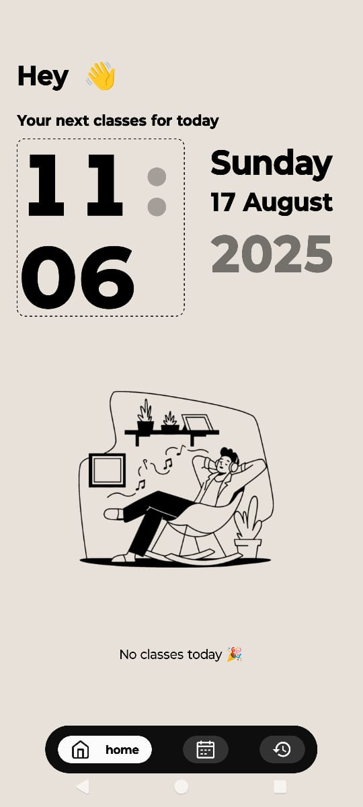
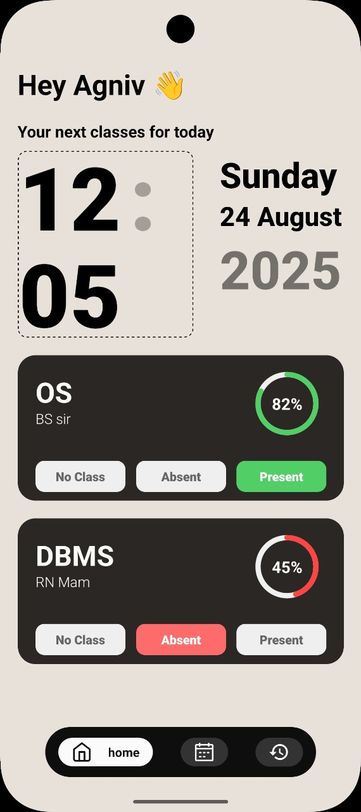
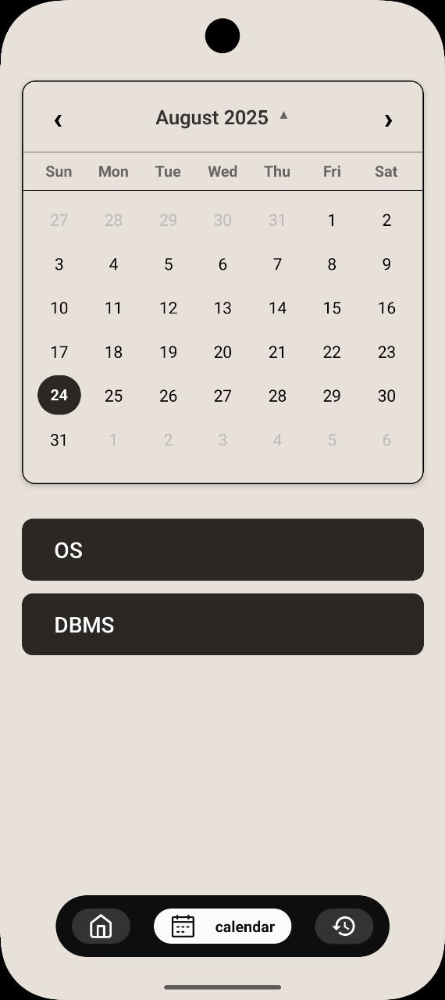
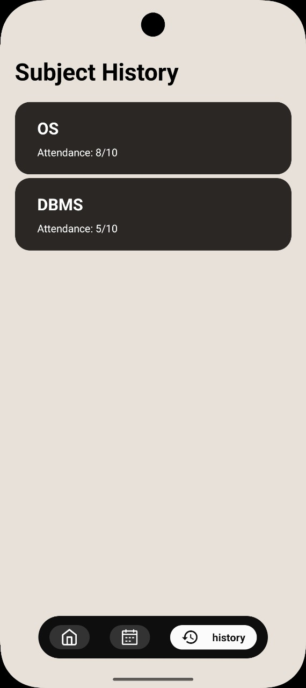
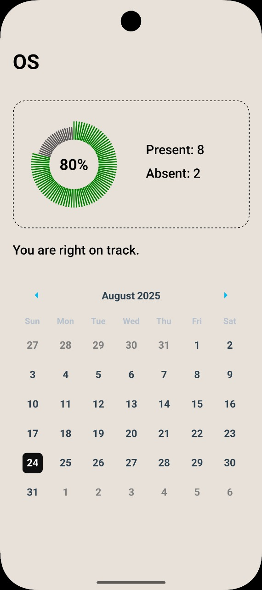

# ClockedIn  
Your friendly companion for tracking college attendance — built by a student who’s been there.  

<p align="center">
  
  
  
  
  
</p>

---

## What’s This About?
We’ve all been there — frantically calculating if skipping that 8 AM lecture will drop you below 75%.  
**ClockedIn** makes attendance tracking *pleasant* (revolutionary, right?).

No more messy spreadsheets or late-night panic math.  
Just a clean, intuitive app showing exactly where you stand in each subject — and how many classes you can *responsibly* afford to miss 😉

---

## Core Features

- **Quick Onboarding:** Set your name, subjects, schedule, and target percentage in minutes.  
- **At-a-Glance Home:** Instantly see today’s classes and your current attendance.  
- **Weekly Calendar:** Expandable view to plan ahead easily.  
- **Real-Time Updates:** Mark yourself present/absent and watch percentages adjust instantly.  
- **Subject Insights:** Tap any subject to see your full attendance history in a color-coded calendar.  
- **Clean Navigation:** Simple bottom tabs that actually make sense.  

---

## Roadmap

**Coming Soon**
- Persistent storage using **MMKV** (data that survives restarts)  
- **Dark Mode** for those late-night attendance checks  
- A proper **Settings page** for more customization  

**Future Ideas**
- Smart pre-class notifications  
- Attendance trends and insights  
- “Safe-to-skip” calculator (the feature we all secretly want 😉)  
- Data export options  

---

## 🛠️ Built With

- **React Native + Expo** – smooth cross-platform development  
- **TypeScript** – for safer, cleaner code  
- **Zustand** – lightweight state management that just works  
- **React Native Calendars** – all the calendar magic  
- **MMKV (coming soon)** – fast, reliable local storage  

---

## Getting Started

### What You’ll Need
- **Node.js v18+**  
- **Expo CLI**  
- An **iOS/Android device** or emulator  

### Setup

```bash
# Clone the repo
git clone https://github.com/AgnivaSengupta/ClockedIn.git
cd clockedIn

# Install dependencies
npm install

# Start the app
npx expo start
```

## 📁 Project Structure

```bash
.
├── app/                            # Core screens and tabs
│   ├── (tabs)/                     # Bottom tab views (calendar, home, history)
│   │   ├── calendar.tsx
│   │   ├── home.tsx
│   │   └── history.tsx
│   ├── onboarding/                # Onboarding screens (username, schedule, target)
│   ├── settings/                  # Settings (Dark mode, etc.)
│   ├── splash/                    # Splash or loading components
│   ├── subject-history/          # Subject-wise history (calendar view - WIP)
│   ├── support/                   # Possibly helper screens
│   ├── _layout.tsx               # App layout wrapper
│   └── index.tsx                 # App entry point
│
├── components/
│   ├── ui/                        # UI components
│   ├   ├── attendanceCard.tsx
│   ├   └── customNavbar.tsx
│   └── Scheduler.tsx
│
├── store/                         # Zustand state stores
│   ├── attendanceStore.ts
│   └── useAppStore.ts
│
├── utils/                         # Utility functions, helpers, constants
│
├── assets/                        # Fonts, images, splash screens, etc.
│
├── .gitignore
├── app.json
├── package.json
├── README.md
└── tsconfig.json
```

## How to Use It

### First Time?
- Open the app and breeze through onboarding.
- Add your subjects and weekly schedule.
- Set your target percentage (probably 75%).
You’re done! Start tracking.

### Day-to-Day
- Open the app to see today’s lineup.
- Tap to mark yourself present or absent.
- Check your updated percentages instantly.
- Use the calendar tab to plan ahead.
- Dive into any subject for detailed history.


<p align="center"> Built with ☕ by a student tired of attendance anxiety. If this saves you from even one attendance-related panic attack, ⭐ the repo! </p>